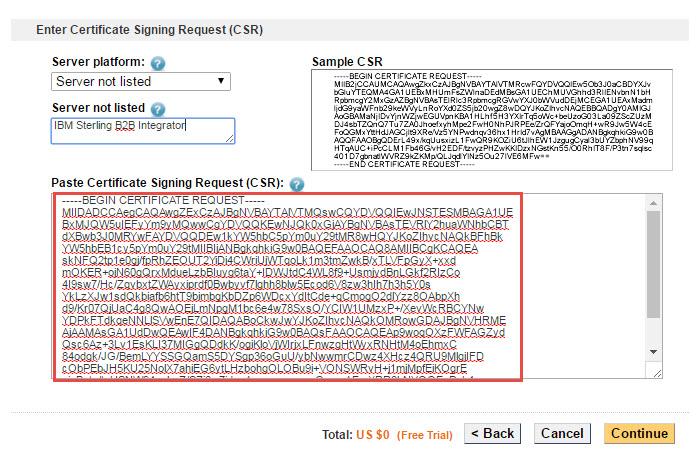
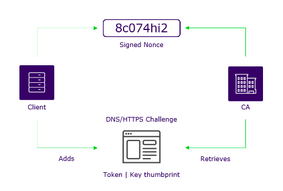
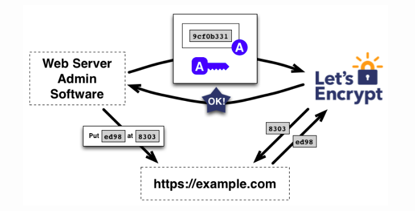

# acme

*acme* is a [CoreDNS](https://github.com/coredns/coredns) plugin that automates certificate management: issuance and renewal. This enables DNS over TLS, a protocol for DNS resolution.

The default certificate authority (CA) used is LetsEncrypt.

## Description
DNS over TLS is currently done through the CoreDNS `tls` plugin. You have to manually create and provide a certificate and key. You also have to do it when the certificate expires.

However, the `acme` plugin automatically creates and renews the certificate for you, using the `ACME` protocol.

`ACME` uses challenges to prove that you own the domain. One challenge is `DNS01`, which requires adding DNS records on the authoritative nameserver for your domain. CoreDNS, as a nameserver, can resolve this by creating and providing the necessary records for solving this challenge.

### Why do you need certificates?
Certificates allow you to perform SSL/TLS where communication between the client and the server is encrypted so that only the intended recipient can access it. Information you send on the Internet is passed from computer to computer to get to the destination server. Any computer in between you and the server can see your sensitive information if it's not encrypted.

When an SSL/TLS certificate is used, the information becomes unreadable to everyone except for the server you are sending the information to. This protects it from hackers and identity thieves.

### Managing Certificates Manually

To generate a TLS/SSL certificate, you need to do the following:
1. Generate a Certificate Signing Request (CSR) with required details

2. Cut and paste the CSR into a Certificate Authority's (CA) web page

3. Prove ownership of the domain(s) in the CSR through the CA's challenges.
4. Download the issued certificate and install it on the server

Managing certificates manually poses a risk to systems in production because:
1. Users can forget to renew certificate until expiration
2. Risk of exposure leads to gaps in ownership and hence Man-in-the-Middle attacks and breaches.

## How ACME works
In the beginning, the client needs to register an account with a CA and add the domain under it. Then it needs to prove that it owns the domain through domain validation.

### Domain Validation

#### Steps:
1. Client first generates a public and private key. Client keeps the private key.
2. The CA issues one or more challenges (DNS/HTTPS/TLS-ALPN) to prove that the client controls the domain.
3. CA also sends a nonce to sign with the private key. This proves that the client controls the public and private keys.
4. Client fulfills the challenge and signs the provided nonce.
5. LetsEncrypt verifies the nonce and checks whether the challenge is fulfilled.
6. Server is authorised to do certificate management for the domain with the key-value pair. The key-value pair is now known as the **authorised** key-value pair.

#### ACME Challenges
These challenges are for proving to the CA that the client owns the domain.
1. [HTTP](https://datatracker.ietf.org/doc/html/rfc8555#section-8.3)
  * Client constructs a key authorization from the token in the challenge and the client's account key. 
  * Client then provisions it as a resource on the HTTP server for the domain and notifies the server. The key authorization will be placed at **http://{domain}/.well-known/acme-challenge/{token}**.
  * Server will try to retrieve the key authorization from the URL and verify its value matches.
2. [DNS-01](https://datatracker.ietf.org/doc/html/rfc8555#section-8.4)
 * Client constructs a key authorization from the token in the challenge and the client's account key. It computes the SHA256 digest of it.
 * Client provisions a TXT record with the digest under **_acme-challenge.{domain}**, the validation domain. Client notifies the server.
 * Server will try to retrieve the TXT record under the validation domain name and verify its value matches.
3. [TLS-ALPN](https://datatracker.ietf.org/doc/html/rfc8737)

#### Certificate Issuance

* Server generates a Certificate Signing Request and a public key. It asks the CA to issue a certificate with this public key.
* Server signs the public key in the CSR and the CSR with the **authorised** private key.
* CA verifies both signatures and issues the certificate.
* Server receives the certificate and installs it on the relevant domain.

Likewise, for revocation, a revocation request is generated and signed with the **authorised** private key. It is then sent to the CA to revoke the certificate.

## Pros and Cons
### Pros
ACME enables automatic renewal, replacement and revocation of domain validated TLS/SSL certificates.

* You no longer have to spend energy and time to keep a watch on their expiry dates and worry about certificates expiring.
* You no longer have to dig out the instructions to renew and configure the certificates.
* You no longer have to worry about data breaches or Man-in-the-Middle attacks that happen when your certificates expire

Just set up ACME once and let it run. At companies, this could save  a lot of manpower and time when there are hundreds of certificates in use.
### Cons
* LetsEncrypt does not offer OV (Organisation Validation) or EV (Extended Validation) certificates as stated in their [FAQ](https://letsencrypt.org/docs/faq/#will-let-s-encrypt-issue-organization-validation-ov-or-extended-validation-ev-certificates).

## Configuration
## Basic
~~~txt
acme {
  domain <DOMAIN>
}
~~~

* `DOMAIN` is the domain name the plugin should be authoritative for.
* Under this configuration, only the **DNS01** challenge will be used for ACME.

## Advanced
~~~txt
acme {
  domain DOMAIN

  # optional parameters
  challenge <CHALLENGE> port <PORT>
}
~~~
You can specify one or more challenges the CA can use to verify your ownership of the domain.
* `CHALLENGE` is the name of the challenge you will use for ACME. There are only two options: `tlsalpn` and `http01`.
* `PORT` is the port number to use for each challenge. Make sure the ports are open and accessible.

## Examples
### Basic
~~~txt
acme {
  domain contoso.com
}
~~~
This will perform ACME for `contoso.com` and use the `DNS01` challenge only.

### Advanced
This configuration:
~~~txt
acme {
  domain example.com

  challenge http port 90
  challenge tlsalpn port 8080
}
~~~
This will perform ACME for `example.com` and perform the following challenges:
1. `HTTP` challenge on port **90**
2. `TLSALPN` challenge on port **8080**
3. `DNS` challenge

## Installation
1. Clone [CoreDNS](https://github.com/coredns/coredns) and add github.com/chinzhiweiblank/coredns-acme into `go.mod`
2. Clone `https://github.com/chinzhiweiblank/coredns-acme`
3. Add `acme:github.com/chinzhiweiblank/coredns-acme` into `plugin.cfg`
4. Run `go mod edit -replace github.com/chinzhiweiblank/coredns-acme=${PATH_OF_PLUGIN}`. This enables you to build CoreDNS with the `coredns-acme` repository you cloned.

## Disclaimer
* Make sure you have the following conditions: 
  * You own the domain
  * Your CoreDNS server is the authoritative nameserver for the domain

## See Also
1. [Challenge Types](https://letsencrypt.org/docs/challenge-types/)
2. [RFC for ACME](https://datatracker.ietf.org/doc/html/rfc8555/)
3. [ACME Protocol](https://www.thesslstore.com/blog/acme-protocol-what-it-is-and-how-it-works/)
